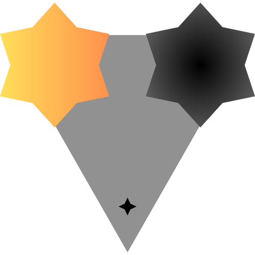

  

# Pulsar-Stellar: Innovating the Union of Robots & Humans

Welcome to Pulsar-Stellar, an evolving framework at the forefront of blending advanced AI cognition with dynamic robotics. Here, we're not just coding robots; we're empowering them to understand, interact, and express in uniquely innovative ways, laying the groundwork for an array of diverse and unique robotic creations.

## About Pulsar-Stellar

Pulsar-Stellar is currently in active development, striving to synergize cognitive processing with expressive mechanics. This framework is your canvas for crafting robots that exhibit distinct personalities and capabilities, far beyond standard functionalities.

### Features

- **Unique Cognitive Processes:** Incorporating deep learning and decision-making for distinct, intelligent robotic behaviors.
- **Diverse Expressive Capabilities:** Enabling robots to convey a range of expressions and emotions in their own unique styles.
- **Versatile Robotics:** Designed to accommodate a wide spectrum of robotic types, from simple mechanical assistants to complex, sentient beings.

## Join Our Community Forum

Be a part of the Pulsar-Stellar journey and connect with a global community of like-minded innovators and creators. Our forum is a space for discussing ideas, sharing knowledge, and collaborating on this exciting frontier of AI and robotics.

[Join the Pulsar-Stellar Forum](https://discord.gg/FtgHSTtd8R)

## Contribute to the Evolution

- **Get Involved:** As Pulsar-Stellar grows, we need your brilliance! Whether it's contributing code, improving documentation, or sharing innovative ideas, your participation is what will make this framework truly exceptional. See our contribution guidelines to start contributing.
- **Explore:** Discover the capabilities of Pulsar-Stellar with our examples.
- **Dive Deeper:** For comprehensive insights and guidance, visit our documentation.

## Community and Collaboration

- **Join a community of visionaries and creators driving the robotic revolution:** Engage with peers and find support on our community forum.
- Keep up-to-date and connect with fellow innovators.

## License

Pulsar-Stellar is an open-source project, proudly shared under the  **MIT License.**

## Embark on a Robotic Adventure

With Pulsar-Stellar, the possibilities are boundless. Be a part of this journey to create robots that don’t just function, but inspire with their uniqueness.